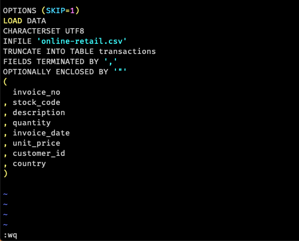
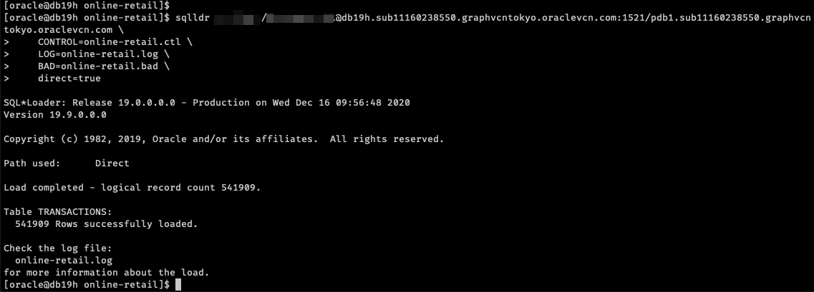
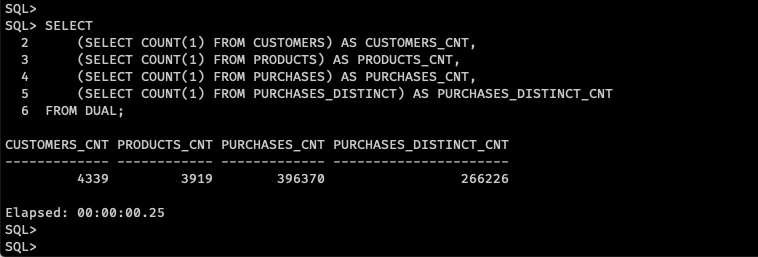

# Create and populate the Online Retail tables

In this article, we will create several tables and populate them with an open data set "Online Retail".
Please visit [here](http://archive.ics.uci.edu/ml/datasets/Online+Retail) to get more details about this dataset.

## Prerequisites

- The DBCS instance has been provisioned
- A demo user has been created and granted proper roles
- Download the dataset csv file

After login to the DBCS instance, perform following commands to download and prepare the dataset we are going to use.

```sh
sudo su - oracle
mkdir online-retail && cd online-retail
wget XXX
unzip online-retail.zip
ls -l
```

## Create tables

Perform following command to connect to the PDB with the user we created already.

```sh
sqlplus <USER>/<PASSWORD>@<CONNECTION STRING TO THE PDB>

# example:
# sqlplus user/password@db19h.sub11160238550.graphvcntokyo.oraclevcn.com:1521/pdb1.sub11160238550.graphvcntokyo.oraclevcn.com
```

Execute following statement to create the `transactions` table.

```sql
DROP TABLE transactions purge;

CREATE TABLE transactions (
  invoice_no VARCHAR2(255),
  stock_code VARCHAR2(255),
  description VARCHAR2(255),
  quantity NUMBER(10),
  invoice_date VARCHAR2(255),
  unit_price NUMBER(10),
  customer_id NUMBER(10),
  country VARCHAR2(255)
);

EXIT;
```

## Load data

Exit from sqlplus and create a SQL*Loader control file `online-retail.ctl` with following content.

```sh
vim online-retail.ctl
```

Content of the SQL*Loader control file.

```sql
OPTIONS (SKIP=1)
LOAD DATA
CHARACTERSET UTF8
INFILE 'online-retail.csv'
TRUNCATE INTO TABLE transactions
FIELDS TERMINATED BY ','
OPTIONALLY ENCLOSED BY '"'
(
  invoice_no
, stock_code
, description
, quantity
, invoice_date
, unit_price
, customer_id
, country
)

```



Perform following command to load the csv

```sh
sqlldr rexgraph/WelCome__111@db19h.sub11160238550.graphvcntokyo.oraclevcn.com:1521/pdb1.sub11160238550.graphvcntokyo.oraclevcn.com \
    CONTROL=online-retail.ctl \
    LOG=online-retail.log \
    BAD=online-retail.bad \
    direct=true
```


## Generate normalized tables

If you don't want to create the normalized tables one by one, you can login to the PDB and execute the SQL script `create_table_normailized.sql` to create all tables by one shot. You should see the result similar to the screenshot below.

```sh
sqlplus <USER>/<PASSWORD>@<CONNECTION STRING TO THE PDB>

# example:
# sqlplus user/password@db19h.sub11160238550.graphvcntokyo.oraclevcn.com:1521/pdb1.sub11160238550.graphvcntokyo.oraclevcn.com

@create_table_normailized.sql
```


Or, you can create the table one by one as below.

### Table: customers

```sql
SET ECHO ON
SET LINESIZE 200
SET TIMING ON
COL stock_code FOR a20
COL country FOR a20
COL description FOR a40

-- customers
DROP TABLE CUSTOMERS PURGE;

CREATE TABLE customers (
  customer_id,
  "country",
  CONSTRAINT customers_pk PRIMARY KEY (customer_id)
) AS
SELECT
  DISTINCT 'cust_' || customer_id,
  MAX(country)
FROM
  transactions
WHERE
  customer_id IS NOT NULL
  AND quantity > 0
GROUP BY
  customer_id;

```

### Table: products

```sql
--products
DROP TABLE products PURGE;

CREATE TABLE products (
  stock_code,
  "description",
  CONSTRAINT product_pk PRIMARY KEY (stock_code)
) AS
SELECT
  DISTINCT 'prod_' || stock_code,
  MAX(description)
FROM
  transactions
WHERE
  stock_code IS NOT NULL
  AND stock_code < 'A'
  AND quantity > 0
GROUP BY
  stock_code;

```

### Table: purchases

```sql
--purchases
DROP TABLE purchases PURGE;

CREATE TABLE purchases (
  purchase_id,
  stock_code,
  customer_id,
  "quantity",
  "unit_price"
) AS
SELECT
  ROWNUM AS purchase_id,
  'prod_' || stock_code,
  'cust_' || customer_id,
  quantity,
  unit_price
FROM
  transactions
WHERE
  stock_code IS NOT NULL
  AND stock_code < 'A'
  AND customer_id IS NOT NULL
  AND quantity > 0;

```

### Table: purchases_distinct

```sql
--purchases_distinct
DROP TABLE purchases_distinct PURGE;

CREATE TABLE purchases_distinct (purchase_id, stock_code, customer_id) AS
SELECT
  ROWNUM AS purchase_id,
  stock_code,
  customer_id
FROM
  (
    SELECT
      DISTINCT 'prod_' || stock_code AS stock_code,
      'cust_' || customer_id AS customer_id
    FROM
      transactions
    WHERE
      stock_code IS NOT NULL
      AND stock_code < 'A'
      AND customer_id IS NOT NULL
      AND quantity > 0
  );


```

### Count the normalized tables

Perform following statement to count the generated tables.

```sql
SELECT
    (SELECT COUNT(1) FROM CUSTOMERS) AS CUSTOMERS_CNT,
    (SELECT COUNT(1) FROM PRODUCTS) AS PRODUCTS_CNT,
    (SELECT COUNT(1) FROM PURCHASES) AS PURCHASES_CNT,
    (SELECT COUNT(1) FROM PURCHASES_DISTINCT) AS PURCHASES_DISTINCT_CNT
FROM DUAL;

```



Now, the Online Retail tables are ready to use.
